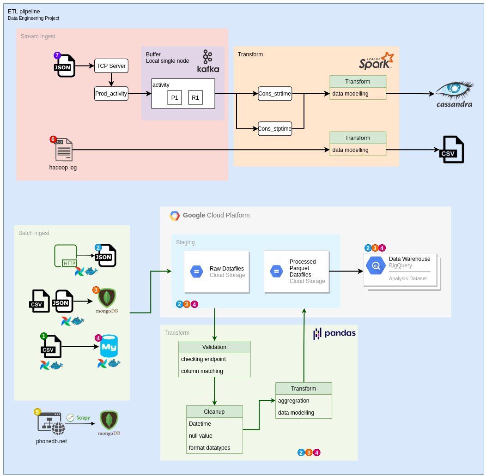

# Data Engineering Projects
## Description

In this project, we want to explore the fundamental of the data engineering by building the data pipeline using  library that comes with Python. This pipeline are use to build the flows of the data from the sources to data scientist,analyst,consumer and etc. The sources are come from various types then ingest it into storage before being transform into clean data before load it into data warehouse for end user.

## [Project 1 : CSV to Mysql](csv-to-mysql_one/)

## [Project 2 : Weather API to Bigquery](weather-api-to-bigquery_two/)

## [Project 3 : Mongodb Tutorial](mongodb-tutorial_three/)

## [Project 4 : Mysql to Bigquery](mysql_to_bigquery_four/)
