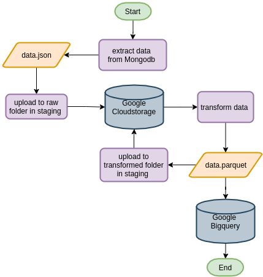
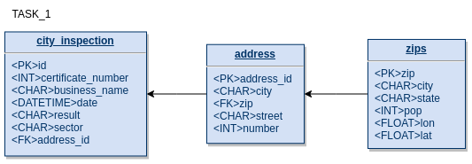
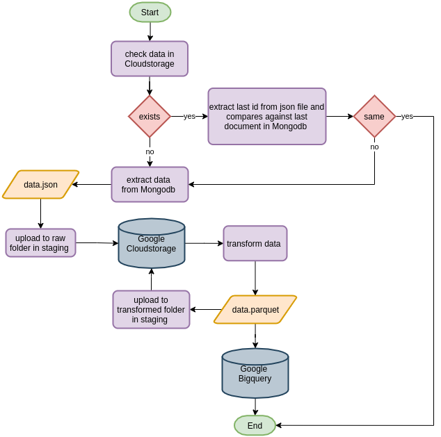
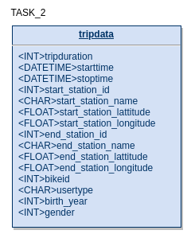
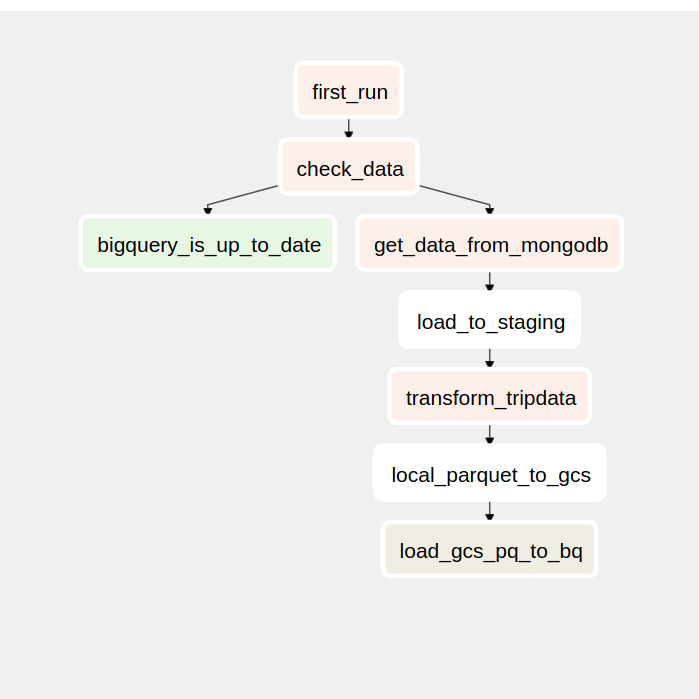

# Mongodb tutorial

## Objective
Acquire dataset from mongodb and send it to data warehouse Bigquery. This project are splits into two part:

Part 1 ingest all the data from city_inspection and zips collections:

Part 2 ingest data from tripdata collection by batch to simulate scheduling jobs: 

All task will follows this pipeline:

1. Extract the data.

2. Upload raw json data to Google Cloud Storage(GCS).

3. Inspect data source,  do transformation and start creating schema for our database.

4. Parquet's file of transformed data are upload to staging, GCS and then create table in Bigquery.

5. Verify the process .

6. Use crontab for task 2.

## Setting up

### Dataset

We will be using three dataset:
- [city_inspections.json](https://github.com/ozlerhakan/mongodb-json-files/tree/master/datasets)
- [zips.json](https://media.mongodb.org/zips.json)
- [tripdata](https://docs.atlas.mongodb.com/sample-data/sample-training/)

Run this command below to import our dataset into mongodb

```
mongoimport --drop -c city_inspection /your/local/path/city_inspection.json
mongoimport --drop -c zips /your/local/path/zips.json
```
```
mongoimport --drop -d test -c tripdata --headerline --type csv  /your/local/path//201901-citibike-tripdata.csv
```

### Python

For Windows and Mac read [here](https://wiki.python.org/moin/BeginnersGuide/Download)

Most Linux OS has Python pre-installed, to check if your machine has python run this command in terminal

```
$ python3 --version
```

If not, run this command to install python 3 and its dependencies

```
$ sudo apt install python3 && sudo pip install pymongo \
											pandas \
											google-cloud-bigquery \
											google-cloud-storage
```
Please note that python version that we use to run this project’s scripts is 3.6.9

### Mongodb

Mongodb installation manual : [here](https://docs.mongodb.com/manual/installation/)

### Crontab 

If you're on Linux machine ,crontab is useful program to automate our ETL task. [crontab](https://linuxhandbook.com/crontab/)

### Airflow
Airflow installation manual : [here](https://airflow.apache.org/docs/apache-airflow/stable/installation.html)


## ETL process

### Task 1 


First task is quite straight forward ETL process where we take data from point a and place it to point b, we'll have staging and transformation process in between point.

1. ``src.from_mongodb.py`` -> extract all data from city_inspection and zips collection, return it as list of document

2.  Convert returned list to json in ``tmp/`` folder.

3. ``src.to_gcs.py`` -> load json file into staging, cloud storage.

4. ``src.mongodb_transform.py``-> begin transformation using json file, look into ``mongodb_transform.ipynb`` for more information about this process.

5. Normalised data, bigquery schema

    

6. ``src.to_gcs.py``-> convert transformed df to parquet file, load into cloud storage and bigquery.

### Task 2 



In order to practice scheduling batch ingestion process, the code in this particular script are modified so its only extracts bunch of documents/rows per-execute

1. Suppose we want to start with a condition since its scheduled task, in ``project_three_2.py`` you may find a function called ``get_initial_id()``, what it does is to initiate the initial behaviour by determine if its on it first run. The function will act as sensor by getting _id from previous job if its exist and the id same as latest documents all process is terminate. if not, resume extraction after that particular id's row,but if it is first run no file in staging storage, it'll start at the beginning of document.

2. ``src.from_mongodb.py`` -> extract 10000's of data from tripdata collection and return it as list of document

3.  Convert returned list to json in ``tmp/`` folder.

4. ``src.to_gcs.py`` -> load json file into staging, cloud storage.

5. ``src.mongodb_transform.py`` -> begin transformation using json file, look into ``mongodb_transform.ipynb`` for more information about this process.

6. Bigquery schema
   
    

7. ``src.to_gcs.py`` -> convert transformed df to parquet file, load into cloud storage and bigquery.

8. ```src.logging_task.py``` -> logs the process.

### Airflow
For task 2



## How to use

Make sure to add google api keys into local environment

``EXPORT GOOGLE_APPLICATION_CREDENTIALS='/local/path/google-keys.json'``

Task 1

Run this file ``project_three_1.py``

Task 2

configure crontab job like this, it'll execute script every day at 20:10 pm
```
10 20 * * 0-6  usr/bin/python3 local/path/project_three_2.py
```

Read ```logs.log``` to see status of our tasks

## Docker
Task 1

```
docker build -t 'project_three_1' -f Dockerfile.project_three_1 .
```

```
docker run -it  \
-e GOOGLE_APPLICATION_CREDENTIALS=/tmp/keys/test-gcs.json \
-v $GOOGLE_APPLICATION_CREDENTIALS:/tmp/keys/test-gcs.json:ro \
-v $(pwd):/app \
--net=host \
project_three_1
```
Task 2

```
docker build -t 'project_three_2' -f Dockerfile.project_three_2 .
```

create shell file 
```
#!/bin/bash         \\ exclude this command if you want to run docker directly in terminal without shell file
docker run -it  \
-e GOOGLE_APPLICATION_CREDENTIALS=/tmp/keys/test-gcs.json \
-v $GOOGLE_APPLICATION_CREDENTIALS:/tmp/keys/test-gcs.json:ro \
-v $(pwd):/app \
--net=host \
project_three_2
```
configure crontab job like this, it'll execute script every day at 20:10 pm

```
10 20 * * 0-6  bash local/path/run_project_three_2_docker.sh
```
  

Read ```project_three_logs.log``` to see status of our tasks

## Airflow

setup connection in ``airflow webserver``, start_date and time_interval in dag file

start ``airlfow scheduler`` in another terminal tab

make sure you find your dag is in the list before trigger them
```
airflow dags list
```

and run command 
```
airflow dags trigger project_three
```

## Reference

[Mongodb documentation](https://docs.mongodb.com/manual/tutorial/)

[Pymongo documentation](https://pymongo.readthedocs.io/en/stable/)

[Python Logging library](https://docs.python.org/3/library/logging.html)

[Pandas documentation](https://pandas.pydata.org/docs/)

[Bigquery guide](https://cloud.google.com/bigquery/docs/quickstarts/quickstart-web-ui)

[Cloudstorage guide](https://cloud.google.com/storage/docs/how-to)

[crontab](https://linuxhandbook.com/crontab/)

[Airflow documentation](https://linuxhandbook.com/crontab/)
