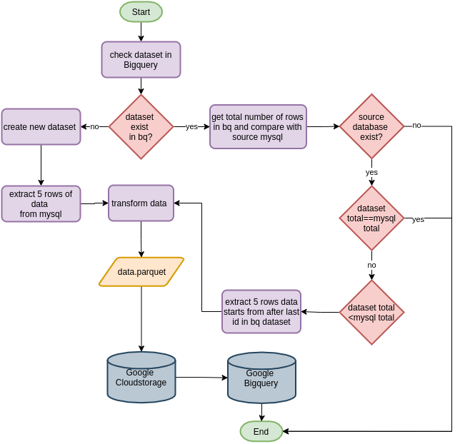

# Mysql to Bigquery

## Objective
Get dataset from database and send it to data warehouse Bigquery by following this pipeline:

1. Extract the data from mysql database.

2. Parquet's file of transformed data are upload to staging, GCS and then create table in Bigquery.

3. Verify the process .

4. Use crontab and ariflow.

## Setting up

### Dataset

we will be using data from project_one or you can find it here : [50000 Sales Records](http://eforexcel.com/wp/wp-content/uploads/2017/07/50000-Sales-Records.zip)

### Python

For Windows and Mac read [here](https://wiki.python.org/moin/BeginnersGuide/Download)

Most Linux OS has Python pre-installed, to check if your machine has python run this command in terminal

```
$ python3 --version
```

If not, run this command to install python 3 and its dependencies

```
$ sudo apt install python3 && sudo pip install mysql-connector-python \
                                            pyarrow \
											pandas \
											google-cloud-bigquery \
											google-cloud-storage 
```
Please note that python version that we use to run this project’s scripts is 3.6.9

### Mysql

mysql installation manual : [here](https://dev.mysql.com/doc/mysql-installation-excerpt/5.7/en/)

### Crontab 

If you're on Linux machine ,crontab is useful program to automate our ETL task. [crontab](https://linuxhandbook.com/crontab/)

### Airflow
Airflow installation manual : [here](https://airflow.apache.org/docs/apache-airflow/stable/installation.html)

## ETL process


In order to practice scheduling batch ingestion process, the code in this particular script are modified so its only extract bunch of rows per-execute.


1. ``check_dataset()`` -> the function will run query to find number of rows in dataset and then compare againts total row in mysql from ``check_database()``

2.  if database not exist it will break the process, if the table in database exist it will choose another condition where it compares between total row in bigquery dataset table and mysql table. it proceed to ``mysql_to_pq()`` when the dataset row is less than mysql table row after extraction complete it will it will return string of 'ready'. or if the total row are the same it will return string 'up to date'.

3.  ``mysql_to_pq()`` created parquet file from extracted database in ``tmp/`` folder.

4. The data source are already denormalised, bigquery will automatically detect schema in parquet file.
   
5. ``src.to_gcs.py`` -> load parquet file into staging, cloud storage only if ''check_dataset()'' return 'ready'.
   
6. ```src.logging.py``` -> logs the process.


### Airflow

The dags was created by combining two project, first part above check_dataset are from project one where we make it load by part instead of bulk. the second part are from project four. Both process extract at different frequency where the tasks at second part, load to data warehouse will process less data compared to database side in the same dag. This was purposely design so that we can simulate how their dependent between each other, vendor and data engineer.Dataset always keeping up to date to database. 


## How to use

Make sure to add google api keys into local environment

``EXPORT GOOGLE_APPLICATION_CREDENTIALS='/local/path/google-keys.json'``

insert your mysql connection information in ``config.json``

Run this file ``project_four.py``

configure crontab job like this
  ``10 20 * * 0-6  usr/bin/python3 local/path/project_four.py``-> it'll execute script every day at 20:10 pm`

Read ```project_four_logs.log``` to see status of our tasks

### Docker

```
docker build -t 'project_four' -f Dockerfile .
```

create shell file 
```
#!/bin/bash         \\ exclude this command if you want to run docker directly in terminal without shell file

docker run -it  \
-e GOOGLE_APPLICATION_CREDENTIALS=/tmp/keys/test-gcs.json \
-v $GOOGLE_APPLICATION_CREDENTIALS:/tmp/keys/test-gcs.json:ro \
-v $(pwd):/app \
--net=host \
project_four
```
configure crontab job like this
  ``10 20 * * 0-6  bash local/path/run_project_four_docker.sh.py``-> it'll execute script every day at 20:10 pm`

Read ```project_four_logs.log``` to see status of our tasks

### Airflow

setup connection in ``airflow webserver``, start_date and time_interval in dag file

start ``airlfow scheduler`` in another terminal tab

make sure you find your dag is in the list before trigger them
```
airflow dags list
```

and run command 
```
airflow dags trigger project_four
```


## Reference

[Mysql documentation](https://dev.mysql.com/doc/)

[Mysql connector/Python API](https://dev.mysql.com/doc/connector-python/en/connector-python-reference.html)

[Python Logging library](https://docs.python.org/3/library/logging.html)

[Pandas documentation](https://pandas.pydata.org/docs/)

[Bigquery guide](https://cloud.google.com/bigquery/docs/quickstarts/quickstart-web-ui)

[Cloudstorage guide](https://cloud.google.com/storage/docs/how-to)

[crontab](https://linuxhandbook.com/crontab/)

[Airflow documentation](https://linuxhandbook.com/crontab/)
