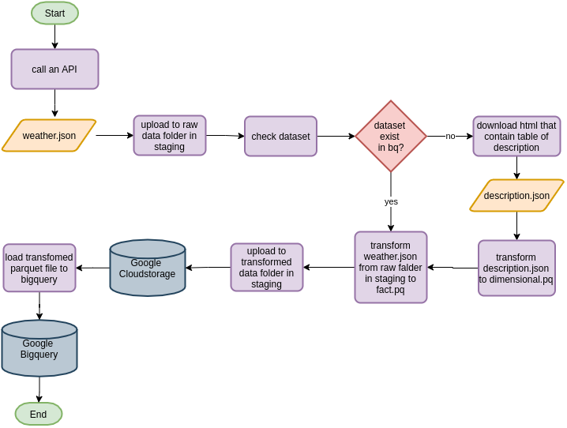
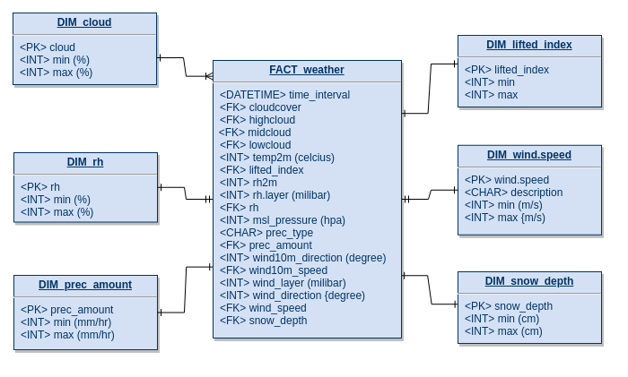
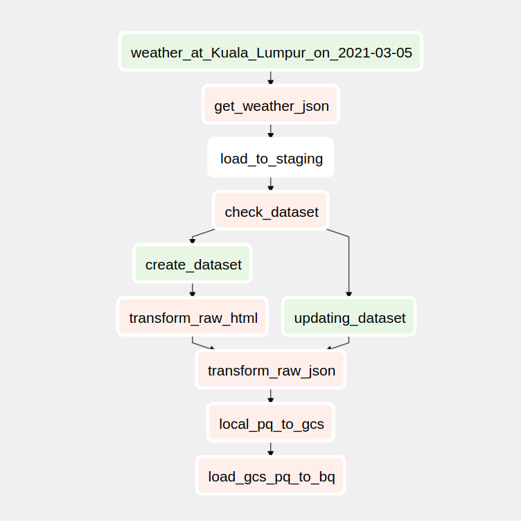

# Weather API to Bigquery

## Objective
Collect weekly weather data of Kuala Lumpur from [7timer](http://www.7timer.info/)

All task will follows this pipeline:

1. Extract the data.

2. Upload raw json data to Google Cloud Storage(GCS).

3. Inspect data source, do transformation and start creating schema for our database.

4. Parquet's file of transformed data are upload to staging, GCS and then create table in Bigquery.

5. Verify the process .

6. Use crontab for task 2.

## Setting up

### Dataset

The data used in this project are METEO product from 7timer which is the rich feature dataset where it provides more insight of the forecast information like wind condition, humidity and etc. you can read about it [here](http://www.7timer.info/doc.php#products)

We will needing two set of data:

1. The actual weather data that we'll request are full with unique keys, we will scrap definition table in [7timer documentation webpage](http://www.7timer.info/doc.php#meteo) so we can translate it better.
2. Weekly json file.

### Python

For Windows and Mac read [here](https://wiki.python.org/moin/BeginnersGuide/Download)

Most Linux OS has Python pre-installed, to check if your machine has python run this command in terminal

```
$ python3 --version
```

If not, run this command to install python 3 and its dependencies

```
$ sudo apt install python3 && sudo pip install \
                                    google-api-core \
                                    google-cloud-bigquery \
                                    pandas \
                                    lxml \
                                    html5lib \
                                    pyarrow
```
Please note that python version that we use to run this project’s scripts is 3.6.9

### Cloud Storage and Bigquery


### Crontab 

If you're on Linux machine ,crontab is useful program to automate our ETL task. [crontab](https://linuxhandbook.com/crontab/)

### Airflow
Airflow installation manual : [here](https://airflow.apache.org/docs/apache-airflow/stable/installation.html)

## ETL process
  


The process will be set to run on every week 

1. ``src._7timerAPI_to_json.py`` -> request METEO product dataset, return it as json

2.  Convert returned list to json in ``tmp/`` folder.

3. ``src.to_gcs.py`` -> load json file into staging, cloud storage.

4. ``src._7timer_transform.py``-> begin transformation using json file, look into ``flatten json nest.ipynb`` for more information about this process.

5. Star schema modelling

    

6. Before load data into data warehouse, the program will check wheather dimensional data are exist in the dataset, if its not a first job the dimensional table will not load only fact table are being updated
    
7. ``src.to_gcs.py``-> convert transformed df to parquet file, load into cloud storage and bigquery.

## Airflow



## How to use

Make sure to add google api keys into local environment

``EXPORT GOOGLE_APPLICATION_CREDENTIALS='/local/path/google-keys.json'``


Configure crontab job with your own schedule time, it'll execute script on every Friday at 20:10 pm
  ```
  10 20 * * */5  usr/bin/python3 local/path/project_two.py
  ```

Read ```project_two_logs``` to see status of our tasks

## Docker

``
docker build -t 'project_two' -f Dockerfile .
``

create shell file 
```
#!/bin/bash         \\ exclude this command if you want to run docker directly in terminal without shell file
docker run -it  \
-e GOOGLE_APPLICATION_CREDENTIALS=/tmp/keys/test-gcs.json \
-v $GOOGLE_APPLICATION_CREDENTIALS:/tmp/keys/test-gcs.json:ro \
-v $(pwd):/app \
--net=host \
project_two
```
Configure crontab job with your own schedule time, it'll execute script on every Friday at 20:10 pm
  ```
  10 20 * * */5  usr/bin/python3 local/path/project_two.py
  ```


Read ```project_two_logs.log``` to see status of our tasks

## Airflow

setup connection in ``airflow webserver``, start_date and time_interval in dag file

start ``airlfow scheduler`` in another terminal tab

make sure you find your dag is in the list before trigger them
```
airflow dags list
```

and run command 
```
airflow dags trigger project_two
```


## Reference
[Python request library](https://2.python-requests.org/en/master/)

[Python Logging library](https://docs.python.org/3/library/logging.html)

[Pandas documentation](https://pandas.pydata.org/docs/)

[Bigquery guide](https://cloud.google.com/bigquery/docs/quickstarts/quickstart-web-ui)

[Cloudstorage guide](https://cloud.google.com/storage/docs/how-to)

[crontab](https://linuxhandbook.com/crontab/)
