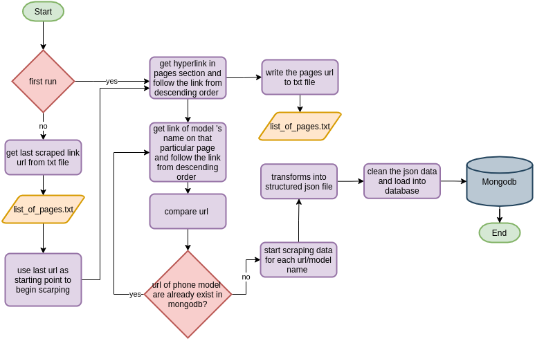

# Scraping Web Tables with Scrapy

## Objective
Get dataset from database and send it to data warehouse Bigquery by following this pipeline:

1. Extract datasheet table using scrapy.

2. Clean dataset.

3. Load to Mongodb.

4. Use crontab to schedule job.

## Setting up

### Dataset

we will be scraping all table from brand Huawei : [Phonedb](http://www.phonedb.net)

### Python

For Windows and Mac read [here](https://wiki.python.org/moin/BeginnersGuide/Download)

Most Linux OS has Python pre-installed, to check if your machine has python run this command in terminal

```
$ python3 --version
```

If not, run this command to install python 3 and its dependencies

```
$ sudo apt install python3 && sudo pip install pymongo
```
Please note that python version that we use to run this project’s scripts is 3.6.9

### Scrapy
```
$ sudo apt install scrapy
```
Scrapy webpage : [here](https://scrapy.org/)

### Mongodb

Mongodb installation manual : [here](https://docs.mongodb.com/manual/installation/)

### Crontab 

If you're on Linux machine ,crontab is useful program to automate our ETL task. [crontab](https://linuxhandbook.com/crontab/)


## ETL process
  


In order to practice scheduling batch ingestion process, the code in this particular script are modified so its only extract bunch of rows per-execute.

Among many components in scrapy framework we only use two, spider class for web crawling and pipelines.py for data flow

   
1. ``tutorial.tutorial.phonedb_spider.py`` -> in this file you can find all the conditional behaviour while perform a web scraping job. There are three level of reponses and requests.
   - ``parse()`` the starting point of the job where the scrapy framework will determine the first url to follow. By design, we created a text file to hold a history of parsed url name ''list_of_pages.txt'' as percaution if it breaks in middle of crawling. If the text file not exist in directory, scrapy will use start_url in class attibutes as starting point then follow last page url.
   - ``parse_previous_page()`` this methods request pages in decending order
   - ``parse_link_in_page()`` every pages requested from ``parse_previous_page()`` contains multiple links to data information of phone's model. Scrapy will extract all the hyperlink and call next parse method only if the name of model in that particular pages are not exist in our database. ``check_mongodb()`` acts as comparator by query the name of url and compare againts scraped url.
   - ``parse_datasheet`` return multilevel 

2. ``pipelines.py``-> manage returned items from spider class.
  -``process_item()`` solely purpose to clean data from umwanted utf-8 characters such as x0A and etc. Insert data to mongodb database.  

## How to use

change attributes in ``tutorial.tutorial.phonedb_spider.PhonedbSpider()``

```
    allowed_domains = ['phonedb.net']
    start_urls = ['https://phonedb.net/index.php?m=device&s=list&first=huawei']
    all_pages='/your/local/dir/list_all_pages.txt'
```
insert your local mongodb info in 

``tutorial.spiders.phonedb_spider.PhonedbSpider.check_mongodb``
``tutorial.DataCleaningPipeline.mongodb``

run using scrapy cli in src dir
```
$ scrapy crawl phonedb 
```

## Result

see json file name ``mongoexport_2doc.json``
## Reference

[Mongodb documentation](https://docs.mongodb.com/manual/tutorial/)

[Pymongo documentation](https://pymongo.readthedocs.io/en/stable/)


[Scrapy tutorial](https://www.tutorialspoint.com/scrapy/index.htm)
